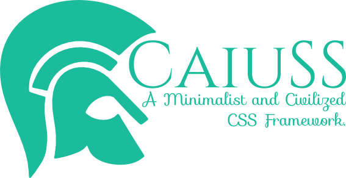
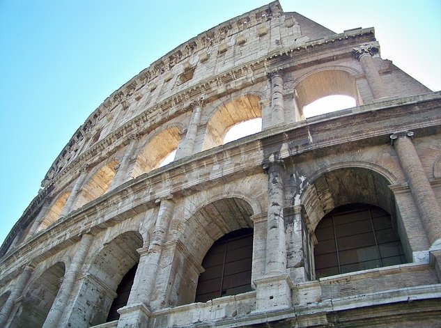

CaiuSS
======
A Minimalist and Civilized CSS framework.

## Demo
Check out the [online demo](http://ionicabizau.github.io/CaiuSS) or download the `gh-pages` branch to see the demo.

[](http://ionicabizau.github.io/CaiuSS)

## Installation
Download the [latest release](/dist) or [a release you choose](https://github.com/IonicaBizau/CaiuSS/releases) and include it on the page:

```html
<link rel="stylesheet" href="path/to/caiuss.min.css">
```

## Elements
### Container
```html
<div class="container">
    ...
</div>
```

### Headings

```html
<h1>h1 heading</h1>
<h2>h2 heading</h2>
<h3>h3 heading</h3>
<h4>h4 heading</h4>
<h5>h5 heading</h5>
<h6>h6 heading</h6>
```

### Tables
```sh
<table class="table">
    <thead>
        <tr>
            <th>#</th>
            <th>Name</th>
            <th>Username</th>
        </tr>
    </thead>
    <tbody>
        <tr>
            <th>1</th>
            <td>Alice</td>
            <td>@alice</td>
        </tr>
        <tr>
            <th>2</th>
            <td>Bob</td>
            <td>@bob</td>
        </tr>
        <tr>
            <th>3</th>
            <td>Carol</td>
            <td>@carol</td>
        </tr>
    </tbody>
</table>
```

### Forms
```html
<form class="form" action="">
    <div>
        <label>
            <span>Email:</span><br>
            <input type="email" placeholder="Your email" class="form-elm">
        </label>
    </div>
    <div>
        <label>
            <span>Password:</span><br>
            <input type="password" placeholder="Your password" class="form-elm">
        </label>
    </div>
    <div>
        <button class="btn bg-white">Login</button>
    </div>
</form>
```

### Buttons
```html
<button class="btn bg-red">Red</button>
<button class="btn bg-orange">Orange</button>
<button class="btn bg-yellow">Yellow</button>
<button class="btn bg-green">Green</button>
<button class="btn bg-blue">Blue</button>
<button class="btn bg-purple">Purple</button>
<button class="btn bg-gray">Gray</button>
<button class="btn bg-white">White</button>
<button class="btn bg-black">Black</button>
```

### Images

```html

```

## Thanks
I thank my brother, [@GhitaB](https://github.com/GhitaB) who came with the idea of the project name.

## How to contribute
1. File an issue in the repository, using the bug tracker, describing the
   contribution you'd like to make. This will help us to get you started on the
   right foot.
2. Fork the project in your account and create a new branch:
   `your-great-feature`.
3. Commit your changes in that branch.
4. Open a pull request, and reference the initial issue in the pull request
   message.

## License
See the [LICENSE](./LICENSE) file.
